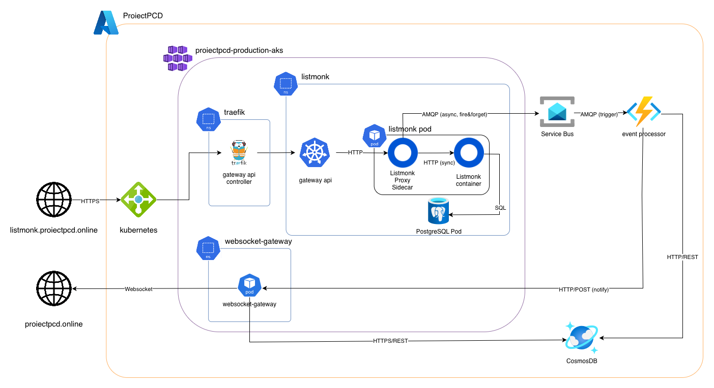

# ProiectPCD — Real-Time Analytics Dashboard

A cloud-native distributed system built on Microsoft Azure that adds a real-time analytics pipeline on top of [Listmonk](https://listmonk.app), an open-source newsletter manager. Events are captured via a reverse proxy, processed asynchronously by an Azure Function, stored in Cosmos DB, and pushed live to a browser dashboard over WebSockets.

**Team:** Mihoc Roxana-Gabriela, Roman Iulian, Zara Mihnea-Tudor

---

## Architecture



---

## Prerequisites

| Tool | Minimum version |
|---|---|
| [Azure CLI](https://learn.microsoft.com/en-us/cli/azure/install-azure-cli) | 2.50 |
| [Terraform](https://developer.hashicorp.com/terraform/install) | 1.5 |
| [kubectl](https://kubernetes.io/docs/tasks/tools/) | 1.28 |
| [Helm](https://helm.sh/docs/intro/install/) | 3.12 |
| [helmfile](https://helmfile.readthedocs.io/en/latest/#installation) | 0.162 |
| [helm-diff plugin](https://github.com/databus23/helm-diff) | any |
| [Docker](https://docs.docker.com/get-docker/) | 24+ (with buildx) |
| [Node.js](https://nodejs.org/) | 20 |

Install the helm-diff plugin once:
```bash
helm plugin install https://github.com/databus23/helm-diff
```

---

## Step 1 — Azure Login

```bash
az login
# Note your subscription ID from the output, you will need it in Step 3.
```

---

## Step 2 — Create the Resource Group

The Terraform configuration and `deploy.sh` both assume the resource group `ProiectPCD` exists in `northeurope`. Create it before running Terraform:

```bash
az group create --name ProiectPCD --location northeurope
```

---

## Step 3 — Configure Terraform

Create `infrastructure/terraform.tfvars` (this file is gitignored, you have an example in `infrastructure/terraform.tfvars.example`) with your Azure subscription ID:

```hcl
subscription_id = "<your-azure-subscription-id>"
```

Then initialise and apply:

```bash
cd infrastructure
terraform init
terraform apply
```

Terraform provisions: AKS cluster, ACR, Azure Service Bus, Cosmos DB (serverless), Azure Function App, DNS zone, and Application Insights.

> **DNS nameservers:** After apply, run `terraform output dns_nameservers` and point your domain registrar's nameservers to the four values shown. The domain must resolve through Azure DNS for cert-manager (Let's Encrypt DNS-01 challenge) to work.

> **Using a different domain:** The domain `proiectpcd.online` is hardcoded in three places. Update all three if you use a different domain:
> 1. `infrastructure/dns.tf` — `name = "proiectpcd.online"`
> 2. `deploy.sh` — `DOMAIN="proiectpcd.online"`
> 3. `applications/frontend/src/App.js` — `wss://websocket.proiectpcd.online/ws`

---

## Step 4 — Create the `.env` file (optional — SMTP only)

`deploy.sh` sources `.env` from the repo root if it exists (you have an example in /.env.example). SMTP configuration is optional; without it the app runs fine but Listmonk cannot send emails.

```bash
# .env (repo root, gitignored)
GMAIL_USER=you@gmail.com
GMAIL_APP_PASSWORD=xxxx-xxxx-xxxx-xxxx
```

---

## Step 5 — Deploy everything

From the repo root:

```bash
./deploy.sh
```

The script performs the following steps in order:

| Step | What it does |
|---|---|
| 1 | Fetches AKS credentials (`az aks get-credentials`) |
| 2 | Logs Docker and Helm into ACR |
| 3 | Builds and pushes `listmonk-proxy`, `websocket-gateway`, and `frontend` images |
| 4 | Deploys cert-manager |
| 5 | Deploys Traefik and waits for its LoadBalancer IP |
| 6 | Updates DNS A records (`*` and `@`) to the Traefik IP |
| 7 | Applies ClusterIssuer + wildcard TLS certificate and waits for it to be issued |
| 8 | Deploys Prometheus / Grafana stack + monitoring HTTPRoutes |
| 9 | Reads Service Bus and Cosmos DB secrets from Terraform outputs |
| 10 | Deploys Listmonk + PostgreSQL, HPA, HTTPRoute, ServiceMonitor, Grafana dashboard |
| 11 | Deploys WebSocket Gateway, HTTPRoute, ServiceMonitor |
| 12 | Deploys Frontend + HPA + HTTPRoute |
| 13 | Deploys Azure Function (zip deploy via `az functionapp deployment`) |

When the script finishes it prints the URLs and the Grafana admin password:

```
==========================================
  Deploy complete!
==========================================
  Listmonk   : https://listmonk.proiectpcd.online
  WS Gateway : https://websocket.proiectpcd.online
  Prometheus : https://prometheus.proiectpcd.online
  Grafana    : https://grafana.proiectpcd.online
  Grafana pw : <generated>
==========================================
```

---

## Day-to-day workflow

**Tear down to save credits (preserves Cosmos DB and Azure Disk):**
```bash
cd infrastructure && terraform destroy
```

**Bring back up:**
```bash
cd infrastructure && terraform apply
./deploy.sh
```

**Redeploy a single service after a code change:**
```bash
# Rebuild and push image
docker build --platform linux/amd64 -t proiectpcdproductionacr.azurecr.io/listmonk-proxy:latest applications/listmonk-proxy/
docker push proiectpcdproductionacr.azurecr.io/listmonk-proxy:latest
# Trigger rolling restart
kubectl rollout restart deployment/listmonk -n listmonk
```

---

## Load Testing

k6 scripts are in `load-testing/`. Run against the public endpoint:

```bash
k6 run load-testing/listmonk-load.js
```

To run in-cluster (avoids internet RTT):

```bash
kubectl run k6 --image=grafana/k6:latest --restart=Never -it --rm \
  -- run - < load-testing/listmonk-load.js
```

---

## Monitoring

- **Grafana dashboard** — `https://grafana.proiectpcd.online` — shows server-side latency (p50/p95/p99), request rate, error rate, HPA replica count, pod CPU/memory, AKS node count, consistency window, and active WebSocket connections.
- **Application Insights** — Azure Portal → Function App → Application Insights, for Function invocation traces.
