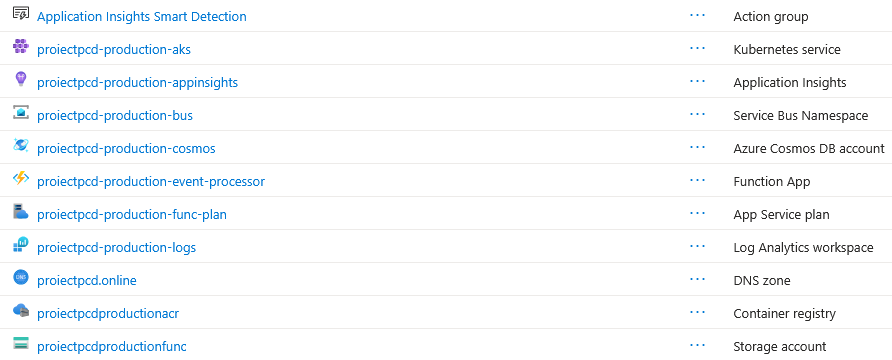
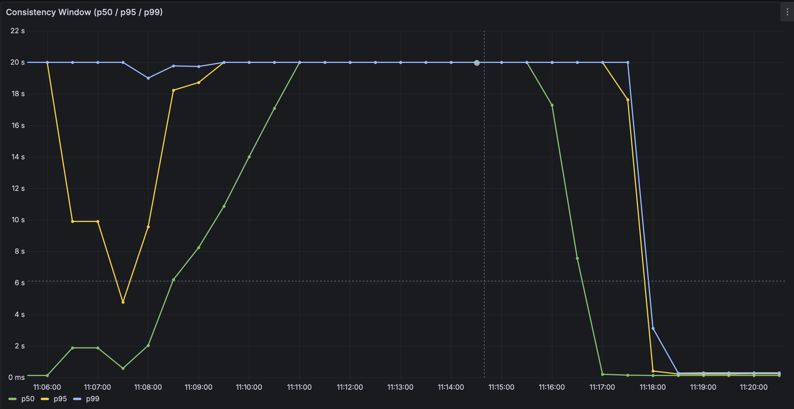
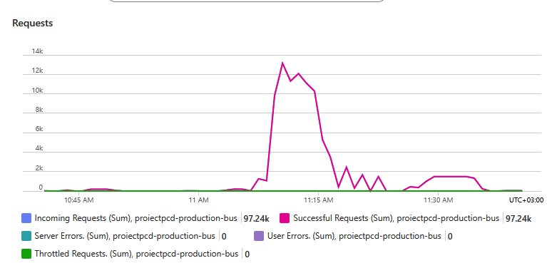
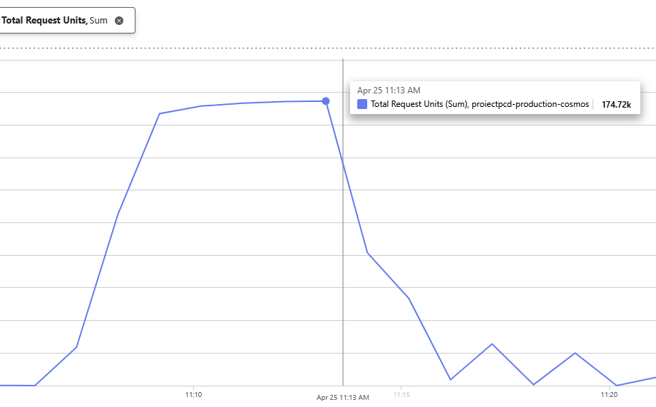
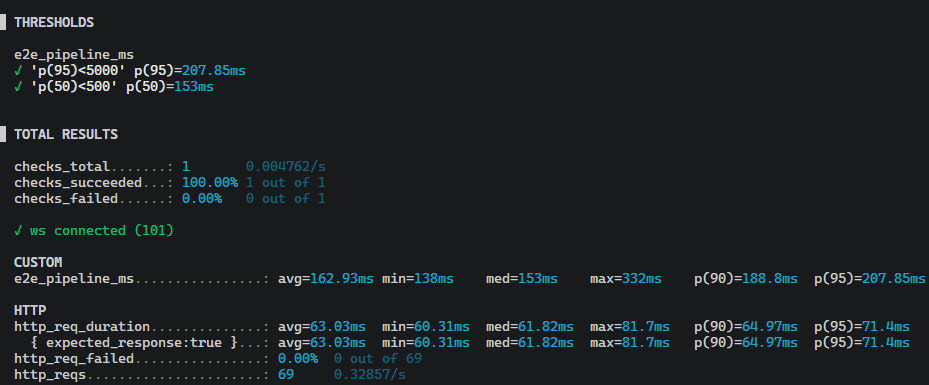
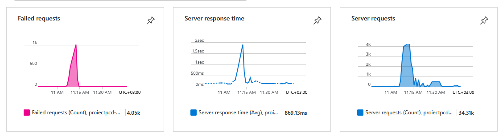
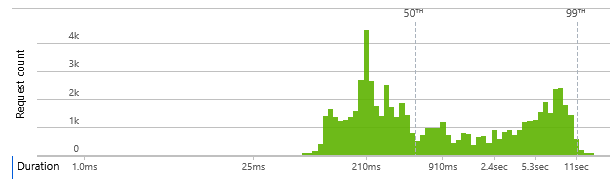
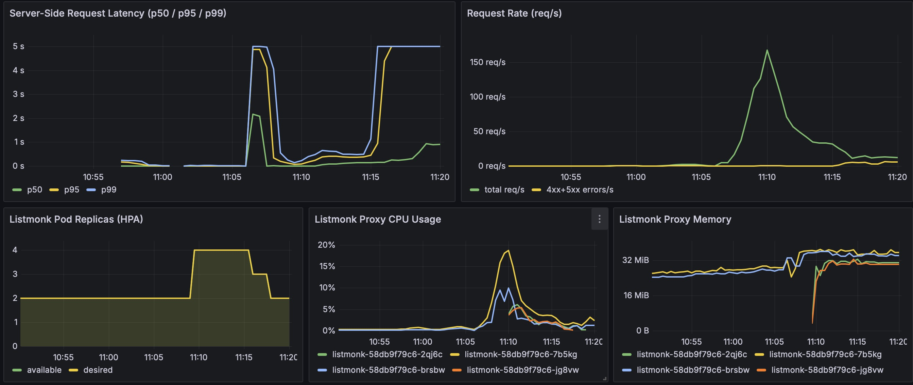
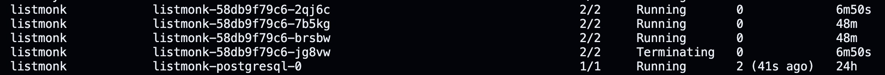
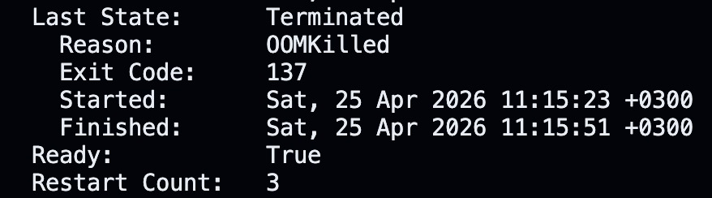

# Real-Time Analytics Dashboard: A distributed system for event driven resource access monitoring

**Team members:** Mihoc Roxana-Gabriela, Roman Iulian, Zara Mihnea-Tudor

**Repository:** [https://github.com/zaramihnea/ProiectPCD](https://github.com/zaramihnea/ProiectPCD)

## 1. Introduction

This report presents the design, implementation, and evaluation of a cloud-native distributed system developed to fulfill the requirements of building a real-time analytics pipeline. The system augments an existing REST API (Listmonk), an open-source newsletter manager (acting as the base application) with real-time analytics without modifying its core codebase. We capture resource-access events through a reverse proxy, process them asynchronously via a serverless component, aggregate statistics in a managed NoSQL store, and stream updates to connected clients over WebSockets.

The platform is deployed entirely on Microsoft Azure, leveraging AKS, Azure Functions, Azure Service Bus, and Cosmos DB. We analyze the system's architecture, communication patterns, and eventual consistency model (CAP theorem), followed by an empirical performance evaluation measuring end-to-end latency, throughput, consistency windows, and failure recovery using k6.

## 2. System Architecture

### 2.1 Overview

The system follows an **event-driven architecture** with clear separation between the *transactional path* (user interacts with Listmonk) and the *analytics path* (events flow through a pipeline to a live dashboard). The two paths are decoupled by Azure Service Bus, which provides durable at-least-once message delivery. To achieve this in a cloud-native Azure environment, we mapped the assignment's architectural requirements to the following specific technologies:

**1. Kubernetes Cluster (AKS):**
All long-running services run inside an Azure Kubernetes Service cluster configured with two node pools. A dedicated *system pool* (Standard_D2s_v3) handles Kubernetes control-plane workloads (CoreDNS, metrics-server, kube-proxy). All application workloads are scheduled exclusively on a *user pool* (Standard_B2s_v2, minimum 2 nodes, maximum 4 nodes) spread across two Azure Availability Zones. Pod anti-affinity rules on Listmonk and the WebSocket Gateway ensure that no two replicas of the same service land on the same node, so a single node failure cannot take an entire service offline. A Cluster Autoscaler monitors pending pods and scales the user node pool out (up to 4 nodes) or in (down to 2) automatically.

**2. Ingress & TLS Termination (Traefik):**
All inbound traffic enters the cluster through **Traefik**, deployed as a DaemonSet on the user node pool and exposed via an Azure Load Balancer. Traefik implements the Kubernetes Gateway API and acts as the single TLS termination point for the custom domain (`proiectpcd.online`), using certificates automatically provisioned by cert-manager from Let's Encrypt. Routing decisions are driven by `HTTPRoute` resources: requests to `listmonk.proiectpcd.online` are forwarded to the Listmonk Proxy service, requests to `websocket.proiectpcd.online` are forwarded to the WebSocket Gateway, and the apex domain serves the Analytics Dashboard. Traefik also handles the HTTP→HTTPS redirect and transparently proxies WebSocket upgrade requests to the Gateway.

**3. Service A & Event Interception (Listmonk Proxy):**
Listmonk and its proxy run as two containers inside the **same Kubernetes pod**, following the *Sidecar* pattern. Listmonk (Go/PostgreSQL) binds on port 9001 and is never exposed externally; the proxy container listens on port 9000 and is the only surface reachable through Traefik. PostgreSQL runs as a separate `StatefulSet` pod with a dedicated PersistentVolumeClaim backed by an Azure Disk, guaranteeing data durability independent of the application pod lifecycle.

To monitor resource usage without modifying Listmonk's core codebase, the proxy inspects every incoming HTTP request against tracked routes (e.g., `/api/subscribers`, `/api/campaigns`). On a match, it publishes a structured event containing a UUID (`eventId`), resource type, HTTP method and a timestamp. The publish is **fire-and-forget**: if the message broker is unreachable, the request still proxies through to Listmonk. This guarantees that analytics instrumentation can never degrade the availability or latency of the underlying application.

**4. Message Broker (Azure Service Bus):**
It acts as the asynchronous buffer between the proxy and the analytics engine. By receiving events on the `resource-events` topic, it absorbs sudden traffic spikes, ensuring the analytics pipeline processes data at its own pace without exerting backpressure on the main proxy.

**5. FaaS Event Processor (Azure Function):**
A serverless Node.js function triggered by the Service Bus. For each message, it performs three operations:

* **Idempotent Storage:** Upserts the raw event into Cosmos DB using the `eventId` as the document identifier. Because the Service Bus guarantees "at-least-once" delivery, duplicate messages safely overwrite identical data without causing duplicate statistics.
* **Aggregation:** Reads the current aggregate document, increments the relevant counter (`totalAccesses`, `totalCreated`, etc.), and writes it back.
* **Notification:** Issues a best-effort HTTP POST to the WebSocket Gateway's `/notify` endpoint with a strict three-second timeout, ensuring a slow gateway cannot starve the function's execution thread.

**6. Stateful Database (Azure Cosmos DB):**
A serverless NoSQL datastore that acts as the single source of truth, persisting both the raw event logs (in the `events` container) and the aggregated statistics (in the `stats` container).

**7. WebSocket Gateway & Dashboard (AKS):**
The WebSocket Gateway exposes `/ws` for client connections and `/notify` for the Event Processor. Upon a new client connection, it queries Cosmos DB for the `initial_state` and pushes it to the client, subsequently broadcasting live `/notify` payloads. The gateway is stateless regarding durable data, but stateful regarding live WebSocket connections. The frontend is a static React application served by nginx, deployed on AKS, that renders the statistics and implements a reconnection strategy to recover from network drops.




### 2.2 Infrastructure Automation and Observability

To ensure a reproducible, production-grade environment, the entire cloud footprint is provisioned declaratively.

* **Infrastructure as Code (IaC):** All underlying Azure resources are provisioned using **Terraform 1.5**. This includes the AKS cluster (configured with isolated system and user node pools for stability), the Azure Container Registry (ACR), the Service Bus namespace (Standard SKU), the Cosmos DB serverless account, and the Linux Function App.
* **Kubernetes Orchestration:** Application deployments are managed via **Helmfile**. This declarative approach orchestrates the deployment of our custom microservices alongside critical cluster add-ons.
* **Networking & Security:** We utilize **Traefik** as the Kubernetes Gateway implementation to route traffic, paired with **cert-manager** to automatically provision Let's Encrypt TLS certificates for our custom domain (`proiectpcd.online`).
* **Observability:** The `kube-prometheus-stack` is deployed to capture deep cluster metrics. This proved essential for identifying scaling behaviors, CPU utilization, and system bottlenecks during our load testing phases.

---

## 3. Communication Analysis — Synchronous vs. Asynchronous

| # | Interaction | Style | Protocol | Justification |
| --- | --- | --- | --- | --- |
| 1 | Browser → Traefik | Sync | HTTPS (TLS termination) | Single entry point for all external traffic; terminates TLS and routes by `Host` header. |
| 2 | Traefik → Proxy / Gateway / Frontend | Sync | HTTP/1.1 | Traefik forwards the decrypted request to the appropriate backend service inside the cluster. WebSocket upgrade requests are transparently proxied. |
| 3 | Proxy → Listmonk | Sync | HTTP/1.1 | Listmonk is the authoritative source of truth; the response must be returned to the user. |
| 4 | Proxy → Service Bus | **Async** (fire-and-forget) | AMQP 1.0 | Decouples analytics from user latency. A failed publish costs analytics, never a user request. |
| 5 | Service Bus → Function | **Async** (broker-managed pull) | AMQP 1.0 | Function processes at its own rate. Backpressure is naturally handled by queue depth; the Consumption plan auto-scales against it. |
| 6 | Function → Cosmos DB | Sync (within invocation) | HTTPS / REST | The function must confirm the write before acking the Service Bus message; otherwise a crash mid-write followed by redelivery would silently drop data. |
| 7 | Function → WebSocket Gateway | **Async** from the business flow, sync within the call, 3 s timeout | HTTP/1.1 | A failed notify only delays the dashboard; durable state is already in Cosmos DB. The timeout prevents a slow gateway from back-pressuring the function. |
| 8 | Gateway → Client | **Async** push | WebSocket | The server initiates the send; polling would waste bandwidth and add latency. One long-lived connection serves arbitrarily many pushes. |

The pattern is that **synchronous calls are used only when the caller truly needs a response**; all other interactions are asynchronous, insulated by either a message bus or a timeout. This keeps latency low on the user-facing path and lets each tier scale independently.

---

## 4. Consistency Analysis

### 4.1 The CAP Trade-off

The system is best characterised as an **AP** (Availability + Partition-tolerance) system. Under a network partition between the Event Processor and Cosmos DB, or between the Gateway and its clients, the system continues serving requests: the proxy still forwards traffic to Listmonk, events accumulate in Service Bus (retained for up to fourteen days by default), and the Function eventually catches up when the partition heals. The cost is that the dashboard is **eventually consistent** with the true state of the application.

A stricter choice like for example, a two-phase commit between Listmonk and Cosmos DB would turn every user request into a distributed transaction, trading user-facing availability for a guarantee that the analytics view never lags. For an analytics use case this would be inefficient, for a payments ledger it would be essential. The choice is therefore contextual, and we make it explicitly in favour of A and P.

### 4.2 Cosmos DB Consistency Level

We selected **Session consistency** for Cosmos DB. This provides monotonic reads, monotonic writes, read-your-writes, and write-follows-reads within a session context. For the Event Processor, a "session" corresponds to a single Function invocation, which performs a read-modify-write on the `stats` container. Session consistency ensures the function reads its own prior write if the same invocation re-reads the document, which is necessary for the aggregate-counter update pattern. A stricter level (Bounded Staleness or Strong) would provide the same guarantee but at measurably higher write latency and RU cost, and is unnecessary because different function invocations are already serialised per-event through the Service Bus subscription.

### 4.3 Idempotency and At-Least-Once Delivery

Service Bus guarantees **at-least-once** delivery: the Function may see the same event twice (for example, if the function crashes after writing to Cosmos DB but before acking the message). Two idempotency mechanisms are in play:

1. **Raw event storage is idempotent.** The upsert into the `events` container uses `eventId` as the document `id`, so a duplicate write is a no-op.
2. **Aggregate update is *not* fully idempotent in the current implementation.** The read–increment–write pattern against the `stats` container has a race window under duplicate delivery: two concurrent redeliveries of the same event could both read the old counter and both write back `old + 1`, resulting in a net increment of two instead of (correctly) one. We acknowledge this as a known limitation. Two remediations are proposed for future work:

    * **(a) Pre-check the events container.** Read `events/{eventId}`; if it already exists with a `processedAt` field, skip the aggregate update.
    * **(b) Cosmos DB stored procedure.** Wrap steps 1 and 2 in a transactional JavaScript stored procedure whose atomicity is guaranteed within a single partition.

### 4.4 Consistency Window

The *consistency window* — the time between a user action and its reflection on the dashboard — is the sum of: proxy publish latency, Service Bus enqueue-to-deliver time, Function cold-start (if any) or warm-invocation time, Cosmos DB write round-trip, HTTP POST to Gateway, and WebSocket broadcast. We measure this window empirically by recording a `lastEventAt` timestamp at the proxy on every publish and computing `receivedAt − lastEventAt` at the WebSocket Gateway `/notify` endpoint, where `receivedAt` is the wall-clock time the notification arrives from the Function.

Measured under steady traffic, the consistency window was bimodal: warm Function invocations completed the full pipeline in **89–165 ms** (p50 ≈ 100 ms, p95 ≈ 200 ms), while the first invocation after a cold-start spike reached **~16 s**. This cold-start outlier corresponds to the Azure Function Consumption plan provisioning a new instance, which confirms the analysis in Section 5.3.



---

## 5. Performance and Scalability

### 5.1 Load Testing Methodology

We used **Grafana k6** to drive load against the public endpoint of the Listmonk Proxy. The test profile was designed to sweep through escalating stages of concurrent virtual users (VUs) (10, 50, 100, and 200 VUs) each sustained for a period of five minutes, with a one-minute ramp between stages. During the test execution, each VU continuously issued authenticated `GET /api/subscribers` requests in a loop, simulating a heavy read-centric traffic pattern typical for a newsletter manager dashboard in production.

```
█ TOTAL RESULTS 

    checks_total...................: 134419  87.907237/s
    checks_succeeded...............: 89.14%  119826 out of 134419
    checks_failed..................: 10.85%  14593 out of 134419

    status is 200
      ↳  89% — ✓ 119826 / ✗ 14593

    HTTP
    http_req_duration..............: avg=861.99ms min=51.18ms  med=118.49ms max=1m0s   p(90)=1.53s   p(95)=2.81s
      { expected_response:true }...: avg=386.68ms min=51.18ms  med=108.46ms max=27.35s p(90)=609.2ms p(95)=1.76s
    http_req_failed................: 10.85%       14593 out of 134419
    http_reqs......................: 134419       87.907237/s

    EXECUTION
    iteration_duration.............: avg=962.59ms min=151.41ms med=219.03ms max=1m0s   p(90)=1.63s   p(95)=2.91s
    iterations.....................: 134419       87.907237/s
    vus............................: 1            min=1                     max=200
    vus_max........................: 200          min=200                   max=200

    NETWORK
    data_received..................: 488 MB       319 kB/s
    data_sent......................: 7.6 MB       5.0 kB/s
```

Service bus requests



Requests to Cosmos



### 5.2 End-to-End Latency

This section measures the End-to-End (E2E) latency of the system. The goal is to find out exactly how long it takes for a request to travel through the entire asynchronous pipeline (Proxy → Azure Service Bus → Azure Function → Cosmos DB) and send a live update back to the client via WebSockets.

To measure this, we ran a k6 script for 3 minutes that sends an HTTP request every 3 seconds. To get an exact latency measurement without worrying about out-of-sync server clocks, the script works purely locally: it records a timestamp right before sending the HTTP request, waits, and then compares it to the timestamp when the WebSocket confirmation (`stats_updated`) arrives. 

The results show that the system is fast:

* **Initial HTTP Response:** The synchronous API returns a response to the user with a median latency (p50) of **61.82 ms**.
* **Full Pipeline (E2E):** The entire background process completes and sends the WebSocket message back to the client with a median latency of **153 ms** (and 95% of requests finish under **208 ms**).

This means the asynchronous background processing (Service Bus + Azure Function) only adds about 90 milliseconds of actual delay. To a user, the live dashboard updates feel instantaneous, proving the decoupled architecture works without adding noticeable lag.



### 5.3 Azure Function Throughput and Auto-Scaling

Because the Azure Function runs on a serverless Consumption plan, it automatically scales out based on how many messages are waiting in the Service Bus queue. The load test data clearly captured this scaling lifecycle.

**Throughput and Scaling**
When the proxy flooded the Service Bus with load, the Azure Function successfully spun up to handle it, reaching a peak throughput of **34.31k requests** during the heaviest phase of the test. 

**Cold Starts and Response Times**
Serverless scaling is not instant. When the massive wave of messages first hit, Azure had to provision new instances. This "cold start" period is visible as a sharp spike in average server response time (peaking around 1.8 seconds). Once the new instances were warm and running, the response time dropped back down to a steady state. During the absolute peak of the load, the function did drop about 4.05k requests, indicating the upper limit of the scaling configuration before saturation.

**Execution Duration Distribution**
The distribution of execution times perfectly illustrates the difference between warm and cold executions:
* **The "Warm" Cluster:** The large spike on the left side of the histogram shows that the vast majority of executions are fast, completing in around **210 ms** once the function is fully scaled.
* **The "Cold" Tail:** The long tail stretching to the right shows the penalty of cold starts and queue buildup. The 50th percentile is dragged to the right, and the 99th percentile stretches out to **11 seconds**. These represent the messages that were waiting in the queue while Azure was busy spinning up new servers.

Ultimately, the function successfully absorbed and processed the massive spike in traffic, acting as a reliable shock absorber for the database.

Response time Azure Function App



Distribution




### 5.4 Scaling Behaviour

* **Listmonk Proxy & Frontend** — both scale horizontally on AKS via a `HorizontalPodAutoscaler` (CPU target: 70%, min: 2, max: 4 replicas). Both tiers are stateless, so no sticky sessions are required. During our load test, the Listmonk deployment scaled from 2 to 3 replicas within approximately two minutes as CPU crossed the threshold.
* **AKS Cluster Autoscaler** — when pending pods cannot be scheduled due to insufficient node capacity, the Cluster Autoscaler provisions additional Standard_B2s_v2 nodes (up to 4) in the user pool across the two configured Availability Zones. Node scale-in is triggered after ten minutes of sustained under-utilisation, subject to pod disruption constraints.
* **Azure Function** — auto-scales from 0 to 200 instances on the Consumption plan, driven by a queue-length heuristic in the Service Bus scale controller. Scale-out is not instantaneous; cold starts add observable tail latency.
* **Cosmos DB serverless** — scales RU capacity automatically but is capped at 5,000 RU/s per container. Beyond this ceiling the provisioned or autoscale mode becomes necessary; partition-key design (`/resourceType`) ensures writes distribute across physical partitions.
* **WebSocket Gateway** — the hardest tier to scale: a given client's connection terminates at one pod, so scaling out requires either (a) sticky-session load balancing, or (b) a pub/sub fan-out between gateway replicas so that a `/notify` POST to any pod reaches clients attached to every pod. The current implementation intentionally runs at a single replica; horizontal scaling of the gateway is identified as future work.

The Grafana panels below capture the HPA scale-out event in real time — replica count rising from 2 to 4 alongside CPU saturation and the resulting latency profile — and the Kubernetes workload recovery view showing pods returning to `Running` after the scale event.





---

## 6. Resilience

### 6.1 WebSocket Reconnection

To handle cloud network instability, the client implements an automatic reconnection mechanism using an exponential backoff strategy where the retry interval starts at 1s and doubles after each failure up to 30s. This logic incorporates jitter to prevent a "thundering-herd" surge on the Gateway during service recovery, while a **manuallyClosed** flag differentiates intentional user actions from network faults to ensure reconnection loops only trigger when necessary.
Upon reconnecting, the server pushes an **initial_state** from Cosmos DB to ensure the UI is **state-correct** by reflecting accurate data even if it is not event-complete due to missed notifications. This trade-off prioritizes data integrity over event history.

### 6.2 Built-in Recovery Mechanisms

* **Kubernetes self-healing** — every application workload runs as a `Deployment`. If a pod crashes or fails its liveness probe, the Kubernetes controller manager immediately schedules a replacement on a healthy node. The desired replica count is continuously reconciled; the system converges back to the declared state without operator intervention. We observed this behaviour directly during load testing: the PostgreSQL pod was OOMKilled by the Linux kernel when memory pressure on the node spiked, entered `CrashLoopBackOff`, and was automatically restarted and restored to `Running` within approximately 90 seconds — with no operator intervention.




* **At-least-once delivery + idempotent storage** — messages survive transient consumer failures without manual intervention.
* **Dead-letter subscription** — permanent "poison" messages are isolated after ten failures so they do not block the subscription.
* **Timeouts on fire-and-forget calls** — prevent a slow dependency from cascading into latency on the critical path.
* **Stateless front tiers** — proxy and gateway pods can be replaced or restarted with no data loss.
* **Declarative infrastructure** — the entire environment is reproducible from Terraform + Helmfile; recovery from catastrophic data-plane loss is bounded by the time to `terraform apply && helmfile sync`.

### 6.3 Infrastructure Resilience

The underlying infrastructure is designed to tolerate both node-level and zone-level failures:

* **Availability Zone distribution** — the AKS user node pool spans two Azure Availability Zones (1 and 2). Each zone is a physically separate datacenter with independent power, cooling and networking. A complete zone outage removes at most half the nodes, but because pod anti-affinity distributes replicas across zones, every service retains at least one healthy pod.
* **Pod anti-affinity** — `requiredDuringSchedulingIgnoredDuringExecution` anti-affinity rules on Listmonk and the WebSocket Gateway prevent co-location of replicas on the same node. Combined with the multi-zone node pool, this means a single hardware failure cannot take an entire service offline.
* **Node autoscaling across zones** — the Cluster Autoscaler provisions replacement or additional nodes across both zones (up to 4 total). New nodes satisfy pending pod scheduling requests within minutes, restoring full capacity automatically.
* **Persistent data protection** — PostgreSQL and Cosmos DB data is protected at the storage layer. The PostgreSQL PVC is backed by an Azure Managed Disk with `prevent_destroy = true` in Terraform, ensuring it survives cluster teardown and rebuild. Cosmos DB is similarly protected and replicates data within the Azure region.
* **Automatic TLS renewal** — cert-manager continuously monitors certificate expiry and renews Let's Encrypt certificates before they lapse, eliminating a class of availability failures caused by expired TLS.

---

## 7. Comparison with Real-World Systems - Netflix Keystone Pipeline
The architecture implemented in this project reflects high-scale patterns used by global platforms to handle massive data streams. A primary example is Netflix, which utilizes a system known as the Keystone Pipeline for its unified event-driven platform.

### 7.1 Architectural Parallels
Much like our design, where Service A (Listmonk) is decoupled from the analytics pipeline via Azure Service Bus, Netflix utilizes Apache Kafka to separate producers from consumers [S1]. In our system, the Service Bus absorbs traffic spikes and ensures that analytics processing does not exert backpressure on the main proxy. This mirrors Netflix’s commitment to ensuring that data ingestion never degrades the performance of the users [S1]. Our Azure Function acts as a serverless event processor, but Netflix has dedicated stream processing jobs like Apache Samza and later Apache Flink which consume from the log and emit to real-time stores [S2].

### 7.2 Data Consistency and Storage
Netflix’s Keystone pipeline operates at a scale of over a trillion events per day and prioritizes high availability, aligning with the AP (Availability and Partition-tolerance) model of the CAP theorem. Similarly, we adopted an AP model for our analytics use case, accepting that the dashboard is eventually consistent with the true state of the application. For storage, we used Azure Cosmos DB with Session consistency to balance performance and accuracy. This approach is comparable to Netflix’s use of distributed NoSQL stores (like Cassandra) to provide high-speed writes for real-time telemetry without the overhead of strong global consistency [S2].

### 7.3 Key Differences at Scale
A fundamental difference lies in the storage model: while our current Service Bus removes messages upon a successful acknowledgment, Netflix’s Kafka infrastructure provides a partitioned, replayable log [S1]. This allows Netflix to re-process historical data in case of a downstream bug, a level of resilience beyond our current scope. Additionally, while our project uses a WebSocket Gateway to push live updates to a dashboard, Netflix uses a complex architecture to serve diverse internal services, from billing to content recommendation engines [S1].

[S1] Keystone Real-time Stream Processing Platform (Netflix Technology Blog): https://netflixtechblog.com/keystone-real-time-stream-processing-platform-a3ee651812a

[S2] Evolution of the Netflix Data Pipeline (Netflix Technology Blog): https://netflixtechblog.com/evolution-of-the-netflix-data-pipeline-da246ca36905

---

## 8. Use of AI Tools

The following AI tools were used during this project:

* **Claude (Anthropic):** used to draft and refine the structure and language of this report.
* **GitHub Copilot:** used to autocomplete boilerplate in the Azure Function handler and suggest Kubernetes manifest patterns.

The team reviewed, tested, and adapted every AI-generated contribution. All architectural decisions, correctness analyses (notably the idempotency critique in Section 4.3), load-test designs, interpretations of results, and conclusions were authored by the team. AI tools were mostly used to understanding the tasks, document phrasing, configuration lookup and design choices.
